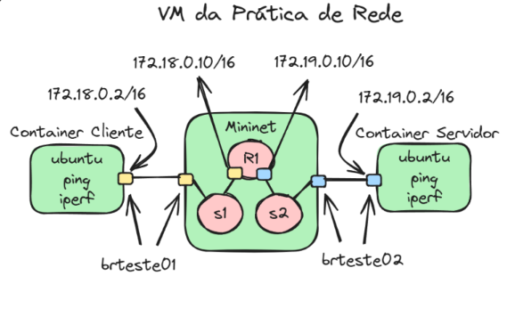

# Mininet + Docker

Este projeto visa resolver uma atividade da disciplina de Redes de Computadores do programa de mestrado PPGTI, com o objetivo de criar uma rede de transporte a partir do emulador de redes **Mininet**. Todo o tráfego de rede entre o container **Cliente** e o container **Servidor** (doravante denominados apenas de **Cliente** e **Servidor**) passará exclusivamente pela rede de transporte implementada no **Mininet**.

Para mais informações, consulte o PDF:
[Instruções sobre a atividade](./PPGTI__RC__Atividade_Mininet_Docker.pdf)



## Passo 1 - Instalação do Docker e Mininet

Antes de iniciar, é necessário instalar o **Docker** e o **Mininet**:

- [Instalação do Docker](https://docs.docker.com/engine/install/)
- [Instalação do Mininet - Passo 2](https://mininet.org/download/#option-2-native-installation-from-source)

## Passo 2 - Criar Redes Docker

Crie as redes **Docker** necessárias para a separação das redes de transporte:

```bash
docker network create --subnet=172.18.0.0/16 --gateway=172.18.0.1 brteste01
docker network create --subnet=172.19.0.0/16 --gateway=172.19.0.1 brteste02
```
## Passo 3 - Criar Containers Cliente e Servidor
Crie os containers **Cliente** e **Servidor** com as configurações de rede apropriadas:
```bash
docker run -itd --name cliente --hostname cliente --network brteste01 --ip 172.18.0.2 --cap-add=NET_ADMIN ubuntu
docker run -itd --name servidor --hostname servidor --network brteste02 --ip 172.19.0.2 --cap-add=NET_ADMIN ubuntu
```

## Passo 4 - Intalação de Pacotes Nescessários
nstale os pacotes necessários para realizar os testes de conectividade e gerenciamento de rede:
```bash
docker exec cliente apt update
docker exec cliente apt -y install iputils-ping iproute2 iperf
docker exec servidor apt update
docker exec servidor apt install -y iputils-ping iproute2 iperf
```

## Passo 5 - Identificar os IDs das Bridges Docker
Liste as redes Docker para obter os IDs das bridges brteste01 e brteste02:
```bash
docker network ls
```
Depois, use o comando `ip link show` para identificar as interfaces correspondentes aos IDs das bridges:
```bash
ip link show
```
As interfaces de rede Docker terão um nome começando com br-, como por exemplo br-xxxxx. Anote esses nomes para a próxima etapa.

## Passo 6 - Alterar os Dados no Script Mininet
Alterar os valores no script Mininet em Python para usar os nomes corretos das interfaces das redes Docker nas variáveis `brteste01` e `brteste02`.

## Passo 7 - Executar o Script Mininet
Execute o script **Mininet** em Python para configurar a rede de transporte:
```bash
sudo python3 arqRedeMininet.py
```

## Passo 8 - Configurar Rotas nos Containers
### Cliente -> Servidor
No container **Cliente**, adicione a rota para alcançar a rede do **Servidor**:
```bash
docker exec cliente ip route add 172.19.0.0/16 via 172.18.0.10
```

### Servidor -> Cliente
No container **Servidor**, adicione a rota para alcançar a rede do **Cliente**:
```bash
docker exec servidor ip route add 172.18.0.0/16 via 172.19.0.10
```

## Passo 9 - Teste de conectividade
### Teste de Ping no Cliente
Dentro do container **Cliente**, execute o seguinte comando para testar a conectividade com o **Servidor**:
```bash
docker exec -it cliente bash
ping 172.19.0.2
```
### Teste de Ping no Servidor
Dentro do container **Servidor**, execute o seguinte comando para testar a conectividade com o **Cliente**:
```bash
docker exec -it servidor bash
ping 172.18.0.2
```